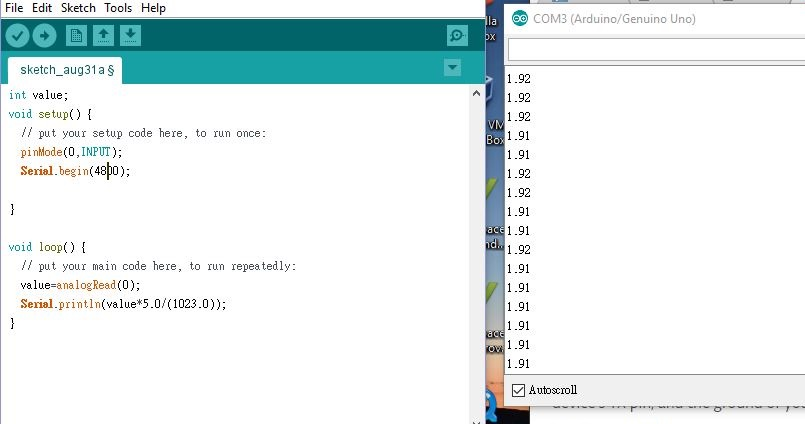
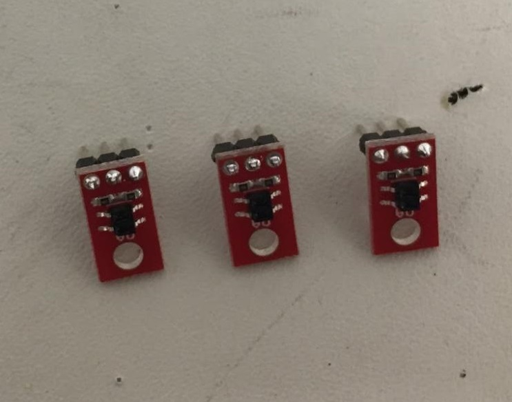

<head>
<link rel="stylesheet" href="../myStyles.css">
</head>

<div class="top-navbar">
  <a href="../index.html">Home</a>
  <a href="../about.html" class="current drop-button">About</a>
    <div class="drop-menu">
      <a href="../about.html">Logistics</a>
      <a href="../about.html">Team Contract</a>
      <a href="../about.html">Meeting Minutes</a>
      <a href="../about.html">Members</a>
    </div>
  <a href="../assignments.html">Assignments</a>
  <a href="../tutorials.html">Tutorials</a>
  <a href="../contact.html">Contact</a>
</div>

# Have a sneak peek...
<iframe width="420" height="315"
src="https://www.youtube.com/embed/0iEf0Ci3siY">
</iframe>

# Purpose
* Get familiar with the Arduino Uno and IDE
* Take initial steps in building and controlling our robot

# Lab Materials
* [Parallax Continuous Rotation Servo](https://www.parallax.com/sites/default/files/downloads/900-00008-Continuous-Rotation-Servo-Documentation-v2.2.pdf)
* Arduino Uno
* LED
* 3306F-103 Potentiometer
* 330Ω Resistors
* [Line sensor QRE1113](http://www.robotshop.com/media/files/pdf/qre1113-datasheet-rob-09454.pdf)

# 1. Blinking An Internal LED
The first mini project is to blink the Internal LED on the Arduino board every second. A built-in LED is already connected to the Arduino board and it is wired to Pin 13. The following code, one of the Arduino IDE example programs, sets up Pin 13 as digital output in the setup() function, and it then repeatedly turns Pin 13 HIGH, waits for one second, turns Pin 13 LOW, waits for one second, creating the blinking effect.
```Arduino
// the setup function runs once when you press reset or power the board
void setup() {
  // initialize digital pin 13, the onboard LED, as an output.
  pinMode(13, OUTPUT);
}

// the loop function runs over and over again forever
void loop() {
  digitalWrite(13, HIGH);   // turn the LED on (HIGH is the voltage level)
  delay(1000);              // wait for a second
  digitalWrite(13, LOW);    // turn the LED off by making the voltage LOW
  delay(1000);              // wait for a second
}	
```

# 2. Blinking an External LED
The second mini project is to blink an external LED, which is wired to the digital output Pin 3. There is 330Ω resistor connected in series with the LED to limit current flow, otherwises, the LED would burn out. The code explanation is the same as the previous mini project except pin 3 is used instead of pin 13.
```Arduino
int ledPin;

void setup() {
	ledPin = 3;
	pinMode(ledPin, OUTPUT);
}

void loop() {
	digitalWrite(ledPin, HIGH);	// turn the LED on
	delay(1000);				// wait for a second
	digitalWrite(ledPin, LOW);	// turn the LED off
	delay(1000);				// wait for a second
}
```


# 3. Reading Value of Potentiometer via Serial Port
In the third mini project, we built a voltage divider and measured the voltage across the potentiometer using analog pin 0. The Arduino has a 10 bit ADC, so its resolution is 2^10 = 1024. When using analog read from Pin 0, it returns a value from 0 to 1023. To convert the input value into voltage, voltage drop across potentiometer = reading value*5/1024. The circuit setup can be viewed below.
<table>
<tr>
	<th>Wiring Setup</th>
	<th>Code Output</th>
</tr>
<tr>
	<td></td>
	<td>
</tr>
</table>

# 4. Map the Value of the Potentiometer to the LED
We used the setup from the previous project to read the voltage drop across a potentiometer, and mapped that analog input to a pulse-width modulator (PWM) that will drive a separate external LED. The purpose is to have the brightness of the LED be proportional to the voltage drop across the potentiometer, which is itself proportional to the value of the potentiometer itself.

The voltage divider is set up so that a 330Ω resistor is placed between 5V and the pin A0, and the potentiometer is connecting A0 to ground. We use the analogRead() function on the A0 pin to get the value of the voltage across the potentiometer, called ‘val’. We connect an LED and a resistor to a digital pin with PWM capability, and drive it using the analogWrite() function. The analogRead() function has 1024 possible output values, but the analogWrite() function can only take inputs between 0 and 255, so we divide the value of ‘val’ by 4 and write that to analogWrite().  This means the duty cycle of the digital pin driving the LED is equal to (‘val’/4)/255 = (‘val’/1020), where ‘val’ varies between 0 and 1020.
```Arduino
int potInput;
int ledPin;

void setup() {
	potInput = A0;
	ledPin = 3;
	pinMode(ledPin, OUTPUT);
	pinMode(potInput, INPUT);
}

void loop() {
	int val = analogRead(potInput);
	analogWrite(ledPin, val/4);
	delay(100); // optional, updates LED 10 times a second
}
```


# 5. Map the Value of the Potentiometer to the Servo
Acquiring a reading from the potentiometer for this task was the same as the previous task, as can be seen from the code. This portion, however, also requires that we drive a servo. To drive the servo, we used the Arduino Servo library. Using this library, we created a Servo object called myservo and used the attach() function to send the output to pin 3 on the Arduino in our setup.

In the loop, we wrote a value to myservo using the Servo write() function which takes values between 0 and 180 as input and outputs a PWM signal to control the servo. For our continuous rotation servos 0 to 89 rotates the servo counter-clockwise, 90 stops the servo, and 91 to 180 rotates the servo clockwise. We mapped the potentiometer reading (0 to 1023) to the servo (0 to 180) by dividing the potentiometer reading by 5.7 (approximately 1023/180). 

Below are oscilloscope readings for the PWM outputs of the Arduino. PWM (Pulse Width Modulation) is a protocol used to control motors through, as the name states, modulating the width of pulses (square waves). For our servos, the pulses are typically between 1ms and 2ms in width and 5V in amplitude. The Arduino Servo library creates these pulses by mapping the function input of 0-180 to a pulse width from 1ms to 2ms. From the oscillascope, we learn that the frequency of the servo PWM is about 50Hz and period is about 20ms.
```Arduino
int potInput;
Servo myservo;

void setup() {
	potInput = A0;
	myservo.attach(3);
	pinMode(potInput, INPUT);
}

void loop() {
	int val = analogRead(potInput);
	myservo.write(val/5.7);
	delay(100); //optional, updates servo value 10 times a second
}
```
<table width="100%">
<tr>
	<td width="33%"></td>
	<td width="33%"></td>
	<td width="33%"></td>
</tr>
<tr>
	<td>Full speed CW
		<br>High pulse duration: 2.4ms
		<br>Duty cycle: 2.4ms/20ms = 12%
		<br><br>Datasheet high pulse duration reference: 1.7ms or 8.5% duty cycle</td>
	<td>Full speed CCW
		<br>High pulse duration: 0.52ms
		<br>Duty cycle: 0.52ms/20ms = 2.6%
		<br><br>Datasheet high pulse duration reference: 1.3ms or 6.5% duty cycle</td>
	<td>No rotation
		<br>High pulse duration: 1.48ms
		<br>Duty cycle: 1.48ms/20ms = 7.4%
		<br><br>Datasheet high pulse duration reference: 1.5ms or 7.5% duty cycle)</td>
</tr>
</table>

We can observe that the maximum duty cycle occurs when the servo is going full speed clockwise, which is 12%. And the minium duty cycle occurs when the servo is going full speed counterclockwise, which is 2.6%. From the datasheet, we learn that for this servo, we only need duty cycle ranges from 6.5% to 8.5%. Guess the Arduino is overkilling it so it works for different kinds of servo :D

# 6. Assemble Our Robot
After completing the first five projects, we began assembling our robot. Using the mounts provided for us, we attached two servos and the Arduino Uno to a small chassis, and placed a small breadboard temporarily underneath the Arduino to facilitate wiring. We wired the power and ground pins of the servos through the breadboard and to an external power supply providing 5V output, and connected the data lines of the two servos to pins 3 and 5 of the Arduino (for left and right servos, respectively). Additionally, we mounted two QRE1113 line sensors to the front of the robot and wired their data lines to the Arduino’s A1 and A2 analog inputs. We provided power to the line sensors by wiring them through the breadboard to the Arduino’s 5V and GND pins.


# 7. Driving Our Robot Autonomously
Code is explained and provided below, but check out our video for demos!

To drive the robot, we have to set up two servos, which are connected to Pin 3 and Pin 5, respectively. We used these two pins, because they are the first two pins that can do PWM. We created a new tab called "Robot.h" that contains functions to drive the robot: walkForward(), walkLeft(), walkRight(), turnLeft() and turnRight().

To drive the robot forward, two servos need to move in the same directions. Because the two servos are mirrored of each other, the values we are writing to them are opposite of each other. We tested it out and fighured out that writing 180 drive left servo forward and and writing 0 drive the right servo forward. To drive the robot to the left, we stop the left servo and drive the right servo forward. Similarly, to drive the robot to the right, we stop the right servo and drive the left servo forward. To make a fast turn to the left, we drive the left servo backward and drive the right servo forward. Similarly, to make a fast turn to the right, we drive the left servo forward and drive the right servo backward.
```Arduino
Servo leftWheel, rightWheel;
//Functions for robot to walk and turn
void walkForward(){ //Moving forward full speed
  leftWheel.write(180);
  rightWheel.write(0);
}

void walkLeft(){ //Slow turn: turn left on just one wheel
  leftWheel.write(90); //Stop left wheel moving
  rightWheel.write(0); //Move right wheel forward
}

void walkRight(){ //Slow turn: turn right on one wheel
  leftWheel.write(180); //Move left wheel forward
  rightWheel.write(90); //Stop right wheel moving
}

void turnLeft(){ //Fast turn: turn left on both wheels
  leftWheel.write(0);   //Move left wheel backward
  rightWheel.write(0);  //Move right wheel forward
}

void turnRight(){ //Fast turn: turn right on both wheels
  leftWheel.write(180); //Move left wheel forward
  rightWheel.write(180);//Move right wheel backward
}
```
We went a step further and soldered two line sensors, which are connected to analog Pin 1 and 2, and their values readings are stored into variables lineMidLeft and lineMidRight. The line sensors keep the robot moving along the line. Their values are ranged from 0 to 1023. If it is above 850, it means it is on top of the black line. If it is below 850, it means it is on top of white space. We attached two line sensors to the front of our robot: lineMidLeft is the left one and lineMidRight is the right one. 

We wrote a sample main code so that the robot follows a black line square. If both sensors detect white space, we make it turn right. If the robot is on top of the black line and the difference between the two line sensors value is less than a tolerance value, say 100, it means the robot is on top of the black line and we just move forward. (We note that sensor value readings tend to fluctuate during sensor testing, therefore, we created a tolerance to address the fluctuations.) Next, if the left sensor has higher value than the right sensor, it means the robot is tilted to the right white space and we have to turn left, so we do the walkLeft() function. Similarly, if the right sensor has higher value than the left sensor, it means the robot is tilted to the left white space and we have to turn right, so we do the walkRight() function.
```Arduino
#include <Servo.h>
#include "Robot.h"
int lineMidLeft, lineMidRight; //Line Sensor Values Variables
int toleranceForward = 100;
int blackDetect = 850; //Under this value means robot is on top of whiteish, above this value means is blackish

void setup() {
  Serial.begin(9600);  //Debug
  leftWheel.attach(3); rightWheel.attach(5); //Setup Servo, Pin3 left wheel, Pin5 right wheel
}

void loop() {
   //Read line sensor values
   lineMidLeft = analogRead(1); lineMidRight = analogRead(2);
  
   //If robot is on top of white space, fast turn right
   if (lineMidLeft < blackDetect && lineMidRight < blackDetect){
   turnRight();
   }
   //Now robot is on top of black line, if two sensors different less than a tolerance, walk forward
   else if ((abs(lineMidLeft-lineMidRight) < toleranceForward)){
    walkForward(); 
   }
   //Otherwises, if sensor to the left has higher value than sensor to the right
   //it means robot is hitting white space on the right, so we turn left 
   else if (lineMidLeft >= lineMidRight){
    walkLeft();
   }
   else if (lineMidLeft < lineMidRight){
    walkRight();
   }

   //Debugging
   Serial.print(lineMidLeft);           
   Serial.print("\t"); 
   Serial.print(lineMidRight);            
   Serial.println("\t");  
}
```

# Extra FUN
### F is for friends who do stuff together, U is for you and me, N is for anywhere and anytime at all, down here in Phillips 427.
*Testing the servo*: the servo turns clockwise when set to 180, stops turning when set to 90, and turns clockwise when set to 0
```Arduino
Servo myservo;

void setup() {
	myservo.attach(3);
}

void loop() {
	// Test servo
	myservo.write(180); //CCW
	delay(1000);
	myservo.write(90); //Stops servo
	delay(1000);
	myservo.write(0); //CW
	delay(1000);
}
```

*Soldering*: soldered pins to the line sensor QRE1113
<table>
<tr>
	<td colspan="2">
</tr>
<tr>
	<td></td>
	<td></td>
</tr>
<tr>
	<td>Caroline Soldering</td>
	<td>Ian Soldering</td>
</tr>
</table>
