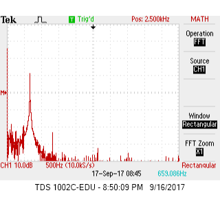

<head>
<link rel="stylesheet" href="../myStyles.css">

</head>

  <a href="../index.html">Home</a>
  <a href="../about.html">About</a>
  <a href="../assignments.html" class="current">Assignments</a>
  <a href="../tutorials.html">Tutorials</a>
  <a href="../contact.html">Contact</a>

# Purpose
The goal of this lab is to add two sensors to our robot. The first is a microphone, which detects a 660Hz tone amidst background noise, and the second is an IR sensor, which detects infrared lights blinking at 7kHz, 12kHz, and 17kHz. To process the analog data received by the two sensors, we make use of the Arduino's on-chip Analog-to-Digital converters and [Open Music Labs Arduino FFT library](http://wiki.openmusiclabs.com/wiki/ArduinoFFT).

# Important Components
* [Electret microphone](https://www.adafruit.com/product/1063)
* [LM158 Op Amp](http://www.ti.com/lit/ds/symlink/lm158-n.pdf)
* [IR receiver](https://www.digikey.com/product-detail/en/lite-on-inc/LTR-301/160-1065-ND/153270)
* Treasures (provided by TAs)

---

# Prelab
### Analog-To-Digital Conversion (ADC)
The ATmega328 has an internal ADC with 10 bits of resolution, driven by an ADC clock we can control through a prescaler. The ADC takes 12 clock cycles to initialize and is capable of completing a single conversion in 13 ADC clock cycles. In a normal conversion, the system does a sample-and-hold at 1.5 ADC clock cycles into the conversion, holding the analog value found at that time. When conversion is complete, the result is written to the ADC Data Registers (ADCL and ADCH), and the ADC Interrupt Flag is set.

The ADC can operate in one of two modes: single conversion or Free Running mode. In Free Running mode, the ADC auto-triggers, meaning it starts a new conversion as soon as the ongoing one is finished. The ADC is constantly sampling and updating the ADC Data Register, and although the ADC Interrupt Flag is set each time, the conversions continue regardless of whether it is getting cleared. Each conversion still takes 13 clock cycles, but an extra half cycle is needed between conversions to reset the prescaler, requiring 13.5 cycles per conversion. 

Successive approximation requires an input clock frequency of 50kHz to 200kHz for maximum resolution, which means data is being sampled at somewhere between around 4kHz to 15kHz in Free Running mode. In other words, each conversion takes between 70us and 270us. We can increase the clock frequency if we need fewer than 10 bits of resolution, but that probably won't be the case. The Arduino's "analogRead()" function is said to read at 100us per conversion, so the ADC clock frequency must be greater than 135kHz to be sampling faster.

### Sampling
Whether referring to the acoustic data from the microphone or IR light data from the detector, it is important that we sample at a rate at least twice as fast as the highest frequency we're detecting in order to correctly identify all frequencies. The microphone is being used to detect a frequency of 660Hz, and any background noise, most likely caused by people speaking, would be mostly less than 4kHz, meaning a sampling frequency of 8kHz would suffice, so either analogRead() function would sample quickly enough. The IR treasure, however, blinks at a maximum of 17kHz, meaning our ADC should preferably be sampling at least at 34kHz. This is is well above the sampling frequency that analogRead() reaches.

### Amplifying and Filtering Signals
In order to improve the quality of the input signals, we could try to make use of amplifiers and filters. We would need to analyze the FFT to determine whether we need a low-pass or high-pass filter, but I would guess that a low-pass filter will be more useful in both cases. For detecting a 660Hz acoustic signal, for example, a cutoff frequency of 1kHz would be conservative yet helpful, while for the 7kHz IR signal a cutoff frequency somewhere in the range of 9kHz could prove useful. We can implement simple passive filters using RLC circuits, or we can use an operational amplifier to implement an active low-pass filter, by connecting a resistor and capacitor in parallel in feedback. We can manipulate the values of the resistor and capacitor to set a cutoff frequency, and because we use an OpAmp the signal will also be amplified. We can also use an operational amplifier simply to amplify the signal, by tying the input signal to the negative end of the opamp, placing the positive end at a constant DC voltage, and putting a resistor in feedback. 

### All The Fourier Stuff
Here is a great PhET simulation for the basic concepts for FFT. The idea is that we take a time-dependent wave and express it as a sum of sinusoids. We only need to specify each sinusoid's coefficient and phase to express our data.

<a href="https://phet.colorado.edu/sims/fourier/fourier_en.jnlp" style="text-decoration: none;">

<table style="position: absolute; width: 200px; height: 80px; left: 50px; top: 58px;"><tr><td style="text-align: center; color: #000; font-size: 24px; font-family: Arial,sans-serif;">Click to Run</td></tr></table></a>
  

As in the simulation above, there must be a way to calculate all those coefficients and *transform* (hint hint) the time domain to the frequency domain, and vice versa. This is the idea behind the Fourier transform. The inverse Fourier transform turns the frequency domain into the time domain, but our code doesn't need it, so we won't concern ourselves with it here.
The discrete time to frequency Fourier transform is given by: 
 
Unfortunately, direct computation of this equation is an O(N^2) algorithm, meaning the time increases exponentially as we have more data. This is because, for every coefficient in the frequency domain, we need to add N terms. In essence, we are adding N terms, N times. The FFT (Fast Fourier Transform) is an O(NlogN) algorithm, which is must faster compared to the regular computation, especially when we have lots of data (eg. large N). The Cooley-Tukey algorithm is the most popular implementation of the FFT. The details are a bit too complicated to explain, but in general, it uses a recursive algorithm to break down data into pieces, resulting in an O(logN) depth for computations. The [Open Music Labs Arduino library](http://wiki.openmusiclabs.com/wiki/ArduinoFFT) takes care of the FFT algorithm for us.

---

# Lab

### Acoustic Team: Assemble Microphone Circuit
<!--<h4 class="h4-color">-->
#### Team Members: Felipe Fortuna, Pei-Yi Lin, Xitang Zhao
# FFT Analysis
The electret microphone given in lab is attached on a breakout board that has an adjustable gain amplifier, with gain range from 25x to 125x. To take advantage of the on board amplifier, we adjusted the breakout hoard to nearly max out the microphone's gain. Also for best performance of the microphone, the "quieter" 3.3V instead of the 5V on the Arduino is used to power the microphone and a 0.1 uF decoupling capacitor is added between 3.3V to GND to minimize disturbance. Vout is connected to the oscilloscope and the followings FFT diagrams are observed:
<table>
<tr>
	<td align="center"></td>
	<!--alt="Wiring Setup - Read Pot Value">-->
	<!--alt="Code - Read Pot Value"-->
	<td align="center"></td>
</tr>
<tr>
	<th>Figure 1: No Tone FFT Output Before Amplification</th>
	<th>Figure 2: 660Hz FFT Output Before Amplification</th>

</tr>
</table>
When no tone is played (Figure 1), other than the DC, there is no noticeable peak throughout the frequency spectrum. The breakout microphone has very good built in nosie rejection circuits and nosie only ranges from 0 to 20dB. Once the 660Hz tone starts playing (Figure 2), an striking 50dB peak can be observed at 660 Hz along with a 18dB harmonic at 1320Hz. 

# Amplifier Circuit
The microphone can pick up the frequency tone very well, but we still like to set up an amplifier circuit that further amplifies and bandpass filters the signal for more stable performance. We used the LM158 Op Amp and set up our amplifier circuit using a 10K and a 100K resister, and this delivers gains of 11 (11 = 1+100k/10k). To create a bandpass filter, a high pass filter of 600 Hz is added between Vout of microphone to + (Pin 3) of LM158 and a low pass filter of 700Hz is added in parallel to the 100k resister.

<table>
<tr>
	<td align="center"></td>
	<td align="center"></td>
</tr>
<tr>
	<th>Figure 3: No Tone FFT Output after Amplification</th>
	<th>Figure 4: 660Hz FFT Output After Amplification</th>
</tr>
</table>

# Distinguish a 660Hz tone (from tones at 585Hz and 735Hz)

### Optical Team: Assemble IR Circuit
#### Team Members: Christina Chang, Caroline Chu, Ian Kranz

