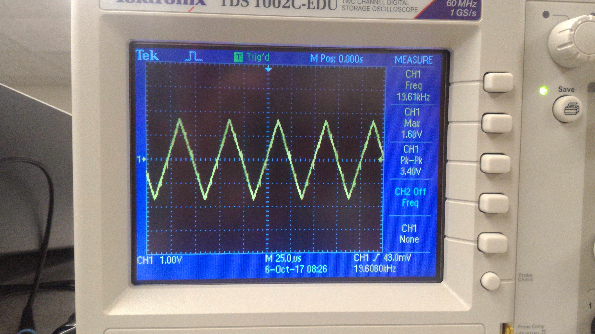
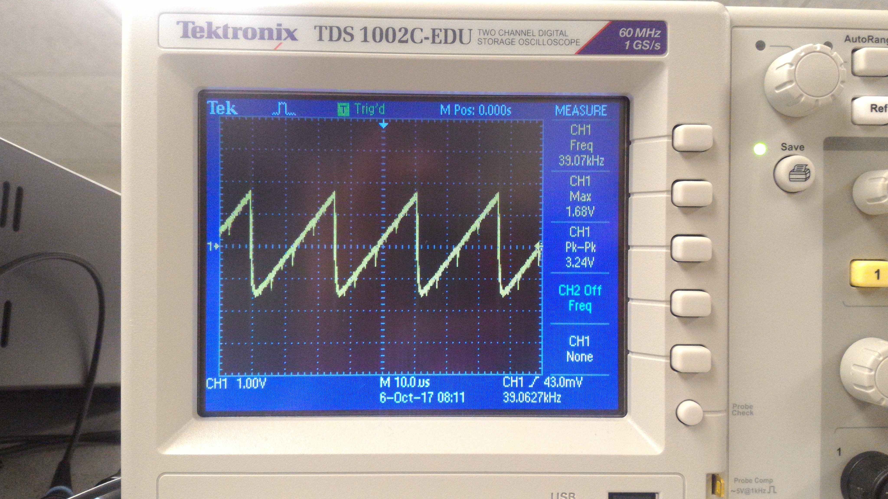

<head>
<link rel="stylesheet" href="../myStyles.css">
</head>

  <a href="../index.html">Home</a>
  <a href="../about.html">About</a>
  <a href="../assignments.html" class="current">Assignments</a>
  <a href="../tutorials.html">Tutorials</a>
  <a href="../contact.html">Contact</a>

 

# Purpose

# Important Components
* [DE0-Nano FPGA board](http://www.terasic.com.tw/cgi-bin/page/archive.pl?Language=English&CategoryNo=165&No=593&PartNo=4)
* 8-bit DAC
* Speaker and audio socket
* VGA switch, screen, cable, and connector

# Graphics Team: Caroline, Xitang, Felipe

# Acoustic Team: Christina, Ian, Pei-Yi

## Square Wave Generation
The simplest wave that can be generated with the FPGA is the square wave. On the FPGA, this involves keeping a counter that will reset whenever we toggle the output to the DAC. Toggling takes place at a rate of twice the frequency we want to play. If we want to play a 440Hz tone, for example, we would have to toggle our output at a rate of 880Hz, once for the rising edge and once for the falling edge. The counter keeps track of how many clock cycles must pass before we toggle.
<!--Insert code snippet and image of generated wave-->

## Triangular and Sawtooth Wave Generation
Triangular and sawtooth waves are a little more involved that square waves. For a sawtooth wave, our counter keeps track of how many clock cycles in just one period. While the counter is still "ticking", we increment the value outputted through the DAC. When the counter reaches 0, we reset the counter and also reset the value outputted through the DAC to 0, which begins the next period.
 
The triangular wave is a little more involved. We do something very similar to the sawtooth wave, but we need to increment and decrement the output, depending on where we are on the wave. A register keeps track of whether we are ascending/descending, and the counter is back to twice the frequency that we want to play, once to make our output descend, and once to make it ascend.

<table>
	<tr>
		<td>Sawtooth Wave</td>
		<td>Triangular Wave</td>
	</tr>
	<tr>
		<td></td>
		<td>
	</tr>
</table>

## Sine Wave Generation
Sine waves can't be generated using the methods described above because there is no "nice behavior" where we can simply increment a register and output that register's value. Therefore, we must use a sine table. This involves saving the values of a sine wave in ROM, which provides a lookup for the value we should be outputting based on where we are in the wave. We save 256 points in our ROM table, so one period contains 256 points. In this case, our counter must keep track of how many clock cycles pass between each of the 256 points.
