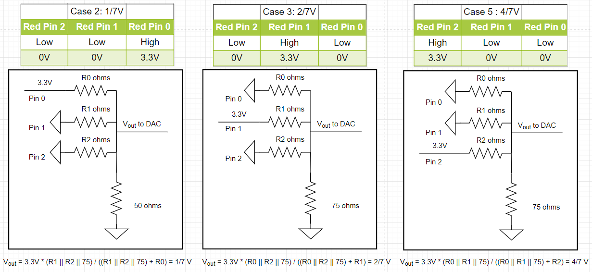
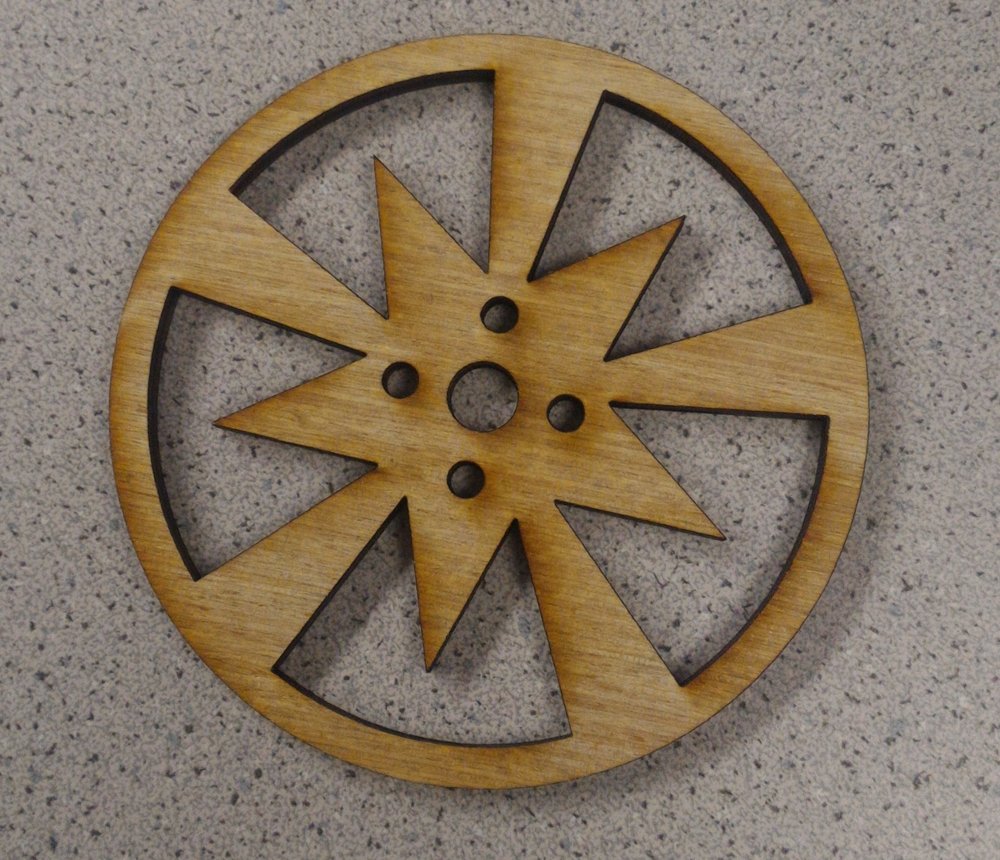

<head>
<link rel="stylesheet" href="../myStyles.css">
</head>

<div class="top-navbar">
  <a href="../index.html">Home</a>
  <a href="../about.html">About</a>
  <a href="../assignments.html" class="current">Assignments</a>
  <a href="../tutorials.html">Tutorials</a>
  <a href="../contact.html">Contact</a>
</div>
<br>

# Loving A Major!
<iframe width="560" height="315" src="https://www.youtube.com/embed/YPeUFlNFCgE" frameborder="0" allowfullscreen></iframe>

# Purpose
In this lab, the purpose is to set up the FPGA so it can (1) take inputs from its switches and the Arduino GPIOs to display a 2x2 grid through a VGA screen, which will represent our maze grid and (2) set up the FPGA to generate a sine wave at 3 different frequencies.

# Important Components
* [DE0-Nano FPGA board](http://www.terasic.com.tw/cgi-bin/page/archive.pl?Language=English&CategoryNo=165&No=593&PartNo=4)
* [8-bit DAC](http://www.bourns.com/docs/Product-Datasheets/R2R.pdf)
* Speaker and audio socket
* VGA switch, screen, cable, and connector

# Graphics Team: Caroline, Xitang, Felipe

## Reading External Inputs to FPGA
We used the DE0-Nano FPGA to display graphics on the VGA monitor. On the FPGA board, there are 4 DIP switches. These switches are in the high level logic state when they are in the down position and low level logic state when are in the up position. In our code, we assign each switch value to each one bit in a 4-bit array. When the FPGA is at state 1, it will check to see which grid coordinate it is currently at. By checking these conditions, we assign each switch to a specific grid coordinate.

## Correctly Updating a 4-bit Array and Mapping External Inputs to Each Quadrant

<iframe width="640" height="360" src="https://www.youtube.com/embed/ji3oeDLhtlM" frameborder="0" allowfullscreen></iframe>

There are two basic structures required to create and update the 4-bit array. We used a simple 2-state FSM to update the state of the array. In the first state, the FSM cycles between the four quadrants of the array, and in the second state it updates the color to drawn on that quadrant, from two possible options. This FSM switches states at a frequency of 25MHz, and it takes 8 cycles to update all four quadrants, so the four quadrants are updated at a frequency of 3.125MHz. We then use a combinational logic block to update the screen. Using the variable grid_width, we create four different quadrants occupying spaces x = [0, grid_width] and x = [grid_width, 2 * grid_width], with y = [0, grid_width] and y = [grid_width, 2 * grid_width], and assign all pixels in each grid to the same value, given by the FSM. 

This structure allows for some flexibility on how the bit array is updated, by simply changing the variables (on the second state of the FSM) that decide what color is to be drawn on what quadrant. Our first implementation mapped the four switches on the FPGA to each of the four quadrants, allowing us to update each quadrant independently by flipping a switch (this was discussed in the previous section, “Reading external inputs to FPGA”). 

```
reg grid_array [1:0][1:0];  //Initialize a 2 x 2 grid array

//Map switches state to grid_array state
always @ (posedge CLOCK_25) 
begin
	if (grid_coord_x == 0 && grid_coord_y == 0) 
	begin 
		grid_array[0][0] <= SW[0]; //Assign switch 0 to gird 0,0
	end
	else if (grid_coord_x == 0 && grid_coord_y == 1) 
	begin 
		grid_array[0][1] <= SW[1]; //Assign switch 1 to gird 0,1
	end
	else if (grid_coord_x == 1 && grid_coord_y == 0) 
	begin 
		grid_array[1][0] <= SW[2]; //Assign switch 2 to gird 1,0
	end
	else if (grid_coord_x == 1 && grid_coord_y == 1) 
	begin 
		grid_array[1][1] <= SW[3]; //Assign switch 3 to gird 1,1
	end
	state <= 0;
end

//Draw color on the grid based on grid_array[x][y], if 1 = green, 0 = white.
always @ (*) 
begin 
if(PIXEL_COORD_X > 0 && PIXEL_COORD_X <  grid_width && PIXEL_COORD_Y > 0 && PIXEL_COORD_Y < grid_width) begin
if (grid_array[0][0]) PIXEL_COLOR = green;
else PIXEL_COLOR = white;
end

... Skip the other 3 else if statements

else begin
 PIXEL_COLOR = black;
end
end

//Assign grid_array[x][y] to LEDs to help debugging
assign LED[0] = grid_array[0][0];
assign LED[1] = grid_array[0][1];
assign LED[2] = grid_array[1][0];
assign LED[3] = grid_array[1][1];

```

Then, we used outputs from the Arduino as inputs to the FPGA, and used those inputs to decide which colors to draw. We implemented a simple timer on the Arduino that would update its outputs every second, which is what is shown in the video above. The FPGA behaved almost identically, except that inputs were taken from GPIO pins instead of from the switches. 

```
//Map GPIOs to grid_array state
always @ (posedge CLOCK_25) 
begin
	if (grid_coord_x == 0 && grid_coord_y == 0) 
	begin 
		grid_array[0][0] <= GPIO_0_D[33];; //Assign GPIO_0 Pin 33 to gird 0,0
	end
	else if (grid_coord_x == 0 && grid_coord_y == 1) 
	begin 
		grid_array[0][1] <= GPIO_0_D[31];; //Assign GPIO_0 Pin 31 to gird 0,1
	end
	else if (grid_coord_x == 1 && grid_coord_y == 0) 
	begin 
		grid_array[1][0] <= GPIO_0_D[29];; //Assign GPIO_0 Pin 29 to gird 1,0
	end
	else if (grid_coord_x == 1 && grid_coord_y == 1) 
	begin 
		grid_array[1][1] <= GPIO_0_D[27];; //Assign GPIO_0 Pin 27 to gird 1,1
	end
	state <= 0;
end
```

## DAC on the Provided VGA and Chosen Resistor Values
The FPGA is setup to send 8-bit RGB color signals (3 bits for red, 3 bits for green, 2 bits for blue) to the VGA driver module. The VGA receiving cable connecting to the monitor are three analog cables: one for red, one for green, and one for blue. Because these analog cables only take values from 0 to 1 V, we have to create a resistor DAC circuitry that converts the eight 3.3V digital outputs (8 color bits) from the FPGA to the desired three 1V analog input signals (3 color cables). Three digital output pins can output eight different combinations and two digital output pins can output four different combinations. To optimize the use of digital pins, eight resistors are specifically chosen for the resistor DAC circuitry to output 8 different intensities or voltages for Red and Green, and 4 for Blue. Let's use the three red signal pins as an example. A good configuration range of its 8 different voltages is 0V, 1/7V, 2/7V … to 1V, which is an even step up of 1/7V.


We have to pick the three resistors value so that the voltage is outputting in the correct desired voltage. We can actually solve the three unknown resistors values by setting up three equations based on the circuits. Three circuits are drawn below that refer to cases 2, 3 and 5 of the previous table. Note that the VGA display has an internal resistance of 50 Ohms and R0 is the resister value for Red Pin 0 and so on. We know the DAD Vout we are expecting of the three cases output, so now there are three equations with three unknowns.



We wrote a findR() function in C that uses brute force to solve for the three resistors values we are looking for. And R0 is found to be 774 ohms, R1 is found to be 394 ohms and R2 is found to be 199 ohms. :D The three resistors values of red pins can also be used for the three green pins. The two bue pins have two resistors values and simplier circutry, which are found to be R0 = 445 ohms and R1 = 197.5 ohms using the same circuit analysis method.

<script src="//onlinegdb.com/embed/js/BkqS8HLpW"></script>


# Acoustic Team: Christina, Ian, Pei-Yi

## Hooking Up FPGA, DAC, and Speaker
The schematic below shows how we wired up the FPGA's pins (specified with GPIO_00, GPIO_01, etc) to the R2R DAC, and how the output was wired to the speaker.


## Square Wave Generation
The simplest wave that can be generated with the FPGA is the square wave. On the FPGA, this involves keeping a counter that will reset whenever we toggle the output. Toggling takes place at a rate of twice the frequency we want to play. If we want to play a 440Hz tone, for example, we would have to toggle our output at a rate of 880Hz, once for the rising edge and once for the falling edge. The counter keeps track of how many clock cycles must pass before we toggle.


## Triangular and Sawtooth Wave Generation
Triangular and sawtooth waves are a little more involved that square waves. For a sawtooth wave, our counter keeps track of how many clock cycles in just one period. While the counter is still "ticking", we increment the value outputted through the DAC. When the counter reaches 0, we reset the counter and also reset the value outputted through the DAC to 0, which begins the next period.
<br>
The triangular wave is a little more involved. We do something very similar to the sawtooth wave, but we need to increment and decrement the output, depending on where we are on the wave. A register keeps track of whether we are ascending/descending, and the counter is back to twice the frequency that we want to play, once to make our output descend, and once to make it ascend.

<table>
	<tr>
		<td align="center">Sawtooth Wave</td>
		<td align="center">Triangular Wave</td>
	</tr>
	<tr>
		<td></td>
		<td></td>
	</tr>
</table>

Please note that, in the diagrams, our waves have extremely high frequencies that aren't audible. We did change these frequencies by increasing our counter variable, so that the waves can be heard when played on the speaker.

## Sine Wave Generation
Sine waves can't be generated using the methods described above because there is no "nice behavior" where we can simply increment a register and output that register's value. Therefore, we must use a sine table. This involves saving the values of a sine wave in ROM, which provides a lookup for the value we should be outputting based on where we are in the wave. We save 256 points in our ROM table, so one period contains 256 points. In this case, our counter must keep track of how many clock cycles pass between each of the 256 points.


## 3 Note Tune
 To generate a 3 note tune, we needed to implement a finite state machine to switch between notes every second. We created parameters corresponding to the number of clock cycles before switching to the next value in the ROM table such that we achieve our desired frequency (this is the maximum value of counter). The note register encodes the current note being played while the note_length register keeps track of the number of clock cycles to play the current note.<br>
In the state machine, we hold one note for one second. After the one second counter expires, we increment note by one to move to the next note. Within the sine generation logic, we implement a multiplexer to set the period of the generated sine wave and thus the note being played through the speakers. The result is as desired; the FPGA outputs a periodic tone of three frequencies to the 8-bit DAC which plays through the speakers. The tune is: Pause, A, C#, E each for one second on a loop.
```
localparam CLKDIVIDERA = ONE_SEC/(256*440);
localparam CLKDIVIDERCsh = ONE_SEC/(256*554);
localparam CLKDIVIDERE = ONE_SEC/(256*660);

... // Input and output declarations here

reg [15:0] counter;
reg [25:0] note_length;
reg [1:0] note;

... // Some variable declarations and setup here

if(note_length == 0) begin
	note_length <= ONE_SEC;
	note <= note + 1;
end

...

case(note)
	2'b00: counter    <= ONE_SEC;
	2'b01: counter    <= CLKDIVIDERA - 1;
	2'b10: counter    <= CLKDIVIDERCsh - 1;
	2'b11: counter    <= CLKDIVIDERE - 1;	
endcase

```

# Before You Go, TAs...
Take a moment to appreciate our awesome laser-cut wheels :) They're wood right now, but will be cut in acrylic later on.

